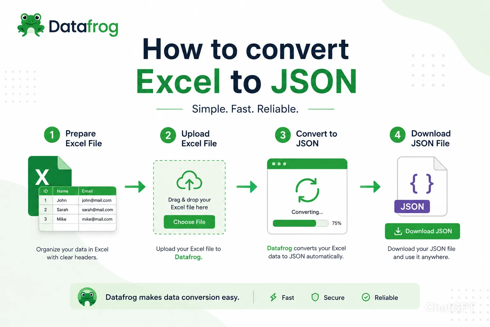
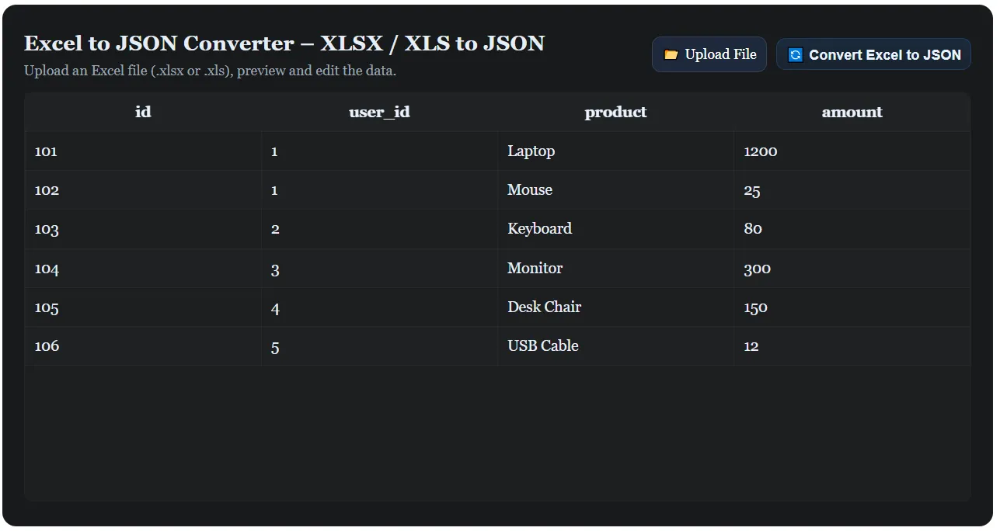
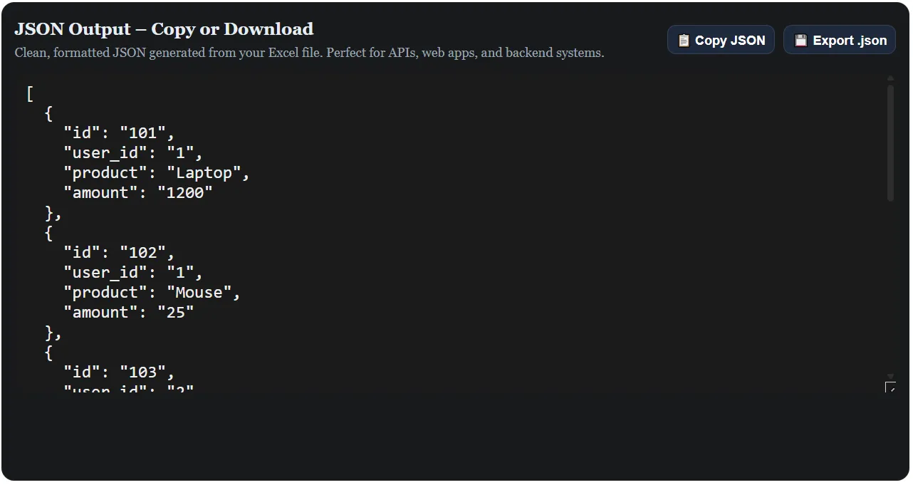

<h1 id="intro-heading">How to Convert Excel to JSON | DataFrog</h1>

  

    Converting Excel to JSON is one of those tasks that sounds complicated but is actually straightforward once you know the right approach. Whether you're a developer preparing data for an API, a data analyst migrating spreadsheets to a NoSQL database, or just someone trying to get their Excel data into a web app, this guide will walk you through everything you need to know.
  

  

    <a href="gourav-mishra" style="display:flex; gap: 10px;" class="link">
      
      Gourav Mishra
    </a>
    June 02, 2026
  

  <figure class="blog-image">
    
    <figcaption style="margin-top: -1.5rem; margin-bottom: 1rem; font-size: 8px">How to Convert Excel to JSON Online</figcaption>
  </figure>

  

    In this guide, you'll learn how to convert Excel (.xlsx and .xls) files to JSON format — both using Excel's built-in tools and using a fast, browser-based converter that requires zero setup. We'll also cover common pitfalls to avoid and tips for getting a clean, production-ready JSON output every time.
  

  <aside class="blog-tool-tip" aria-label="Recommended Excel to JSON Converter">
    

      For a faster, privacy-focused solution, try our 
      <a href="/excel-to-json" title="Free Excel to JSON Converter" class="link">free, browser-based Excel to JSON converter</a>. It works directly in your browser, never uploads your file to any server, and converts your spreadsheet to clean JSON instantly — perfect for sensitive data.
    

  </aside>

  

    By the end of this guide, you'll be able to confidently convert any XLS or XLSX file to JSON — whether you're working manually in Excel or using our one-click online converter.
  

</section>

<section aria-labelledby="why-heading">
  <h2 id="why-heading">Why Convert Excel to JSON?</h2>
  

    Excel is a great tool for organizing and viewing data, but it's not the format modern applications speak natively. JSON (JavaScript Object Notation) is the standard for APIs, web apps, NoSQL databases, and virtually every developer tool in use today.
  

  

    When you convert Excel to JSON, each row becomes a JSON object, and your header row becomes the keys. The result is a clean array of objects that any backend, frontend, or database can work with immediately — no parsing headaches required.
  

  <ul>
    <li>Load spreadsheet data into REST APIs and web services.</li>
    <li>Seed NoSQL databases like MongoDB, Firebase, or DynamoDB.</li>
    <li>Feed data into JavaScript frontends (React, Vue, Angular).</li>
    <li>Automate ETL pipelines and data transformation workflows.</li>
    <li>Hand off structured data from non-technical teams to developers.</li>
  </ul>
</section>

<section aria-labelledby="method1-heading">
  <h2 id="method1-heading">Method 1: Convert Excel to JSON Using Our Free Online Tool</h2>
  

    The fastest and most privacy-friendly way to convert Excel to JSON is using 
    <a href="/excel-to-json" class="link" title="Excel to JSON Converter">DataFrog's Excel to JSON converter</a>. 
    Everything runs in your browser — your file is never uploaded to any server.
  

  <h3>How to Use the Converter</h3>
  <ol>
    <li>
      <strong>Upload Your Excel File:</strong> Click <strong>Upload File</strong> and select your <code>.xlsx</code> or <code>.xls</code> file from your device.
      <figure class="blog-image">
        
        <figcaption>Upload your .xlsx or .xls file</figcaption>
      </figure>
    </li>
    <li>
      <strong>Preview and Edit the Data:</strong> Your spreadsheet appears in an editable table. Clean up column names, remove unwanted rows, or fix typos — all before converting.
    </li>
    <li>
      <strong>Convert and Download:</strong> Click <strong>Convert Excel to JSON</strong>. Copy the output to your clipboard or download it as a <code>.json</code> file.
      <figure class="blog-image">
        
        <figcaption>Download or copy your clean JSON output</figcaption>
      </figure>
    </li>
  </ol>

  <h3>Use Cases</h3>
  <ul>
    <li>Preparing product catalogs or user lists for REST APIs.</li>
    <li>Exporting business data from Excel for use in MongoDB or Firebase.</li>
    <li>Converting datasets for use in React or Vue applications.</li>
    <li>Transforming reports and analytics data into developer-friendly JSON.</li>
  </ul>

  <aside class="blog-tool-tip" aria-label="Try the Excel to JSON Converter">
    

      Try the <a href="/excel-to-json" class="link" title="Excel to JSON Converter">Excel to JSON converter</a> today — fast, secure, and no installation required.
    

  </aside>
</section>

<section aria-labelledby="method2-heading">
  <h2 id="method2-heading">Method 2: Convert Excel to JSON Using Power Query (Built-In Excel)</h2>
  

    If you prefer to stay within Excel and export JSON manually, you can use a combination of Power Query and a bit of scripting. This approach works well for users already familiar with Excel's data tools.
  

  <h3>Step-by-Step Guide</h3>
  <ol>
    <li>Open your Excel file and make sure your data has a clean header row in row 1.</li>
    <li>Go to <strong>Data &gt; Get Data &gt; From Table/Range</strong> to load data into Power Query.</li>
    <li>In Power Query, review your columns and data types.</li>
    <li>For a direct JSON export, use a VBA macro or a Python script with <code>pandas</code> to read the Excel file and write the output as <code>.json</code>.</li>
  </ol>

  
<em>Pro Tips:</em>

  <ul>
    <li>Excel does not have a native "Export to JSON" button — you'll need a script or an online tool for a true JSON file output.</li>
    <li>For large files, Python's <code>pandas</code> library (<code>df.to_json()</code>) is the most reliable programmatic approach.</li>
    <li>For non-technical users, the browser-based converter above is significantly faster.</li>
  </ul>
</section>

<section aria-labelledby="tips-heading">
  <h2 id="tips-heading">Tips for Getting a Clean JSON Output from Excel</h2>
  

    A little preparation before converting goes a long way toward getting accurate, usable JSON:
  

  <ul>
    <li><strong>Row 1 must be your header row</strong> — these become the JSON keys. Make sure they're descriptive and consistent.</li>
    <li><strong>Avoid merged cells</strong> — they don't translate cleanly and can produce unexpected output.</li>
    <li><strong>Use consistent data types per column</strong> — mixing text and numbers in one column can cause type inconsistencies.</li>
    <li><strong>Remove fully empty rows</strong> — they generate blank objects in the JSON array.</li>
    <li><strong>Keep column names simple</strong> — use <code>camelCase</code> or <code>snake_case</code> instead of spaces and special characters.</li>
    <li><strong>Preview before exporting</strong> — DataFrog's editable table lets you fix issues before generating JSON.</li>
  </ul>
</section>

<section aria-labelledby="errors-heading">
  <h2 id="errors-heading">Common Issues When Converting Excel to JSON and How to Fix Them</h2>
  <ul>
    <li><strong>Blank objects in output:</strong> Caused by empty rows in the spreadsheet. Delete empty rows before converting.</li>
    <li><strong>Wrong data types:</strong> Numbers stored as text in Excel may appear as strings in JSON. Check column formatting beforehand.</li>
    <li><strong>Date values become strings:</strong> This is expected behavior. Format dates consistently in Excel if downstream systems require a specific date format.</li>
    <li><strong>Missing columns:</strong> Usually caused by blank header cells. Ensure every column has a header in row 1.</li>
    <li><strong>Special characters in output:</strong> Make sure your Excel file is saved with UTF-8 encoding to avoid garbled characters.</li>
  </ul>
</section>

<section aria-labelledby="understand-heading">
  <h2 id="understand-heading">Understanding the Excel and JSON Structure Difference</h2>
  

    It helps to understand why Excel and JSON don't naturally speak the same language — and what the conversion actually does.
  

  <table style="width:100%; border-collapse: collapse; font-family: Georgia, serif; font-size: 1rem;">
    <thead>
      <tr style="background:#f0f0f0;">
        <th style="padding: 8px; border: 1px solid #ddd;">Feature</th>
        <th style="padding: 8px; border: 1px solid #ddd;">Excel (.xlsx)</th>
        <th style="padding: 8px; border: 1px solid #ddd;">JSON</th>
      </tr>
    </thead>
    <tbody>
      <tr>
        <td style="padding: 8px; border: 1px solid #ddd;">Structure</td>
        <td style="padding: 8px; border: 1px solid #ddd;">Rows and columns</td>
        <td style="padding: 8px; border: 1px solid #ddd;">Objects and arrays</td>
      </tr>
      <tr>
        <td style="padding: 8px; border: 1px solid #ddd;">Data types</td>
        <td style="padding: 8px; border: 1px solid #ddd;">Inferred or formatted</td>
        <td style="padding: 8px; border: 1px solid #ddd;">Typed (string, number, boolean, null)</td>
      </tr>
      <tr>
        <td style="padding: 8px; border: 1px solid #ddd;">Nesting</td>
        <td style="padding: 8px; border: 1px solid #ddd;">Flat only</td>
        <td style="padding: 8px; border: 1px solid #ddd;">Deeply nested supported</td>
      </tr>
      <tr>
        <td style="padding: 8px; border: 1px solid #ddd;">Machine-readable</td>
        <td style="padding: 8px; border: 1px solid #ddd;">Requires parsing</td>
        <td style="padding: 8px; border: 1px solid #ddd;">Native for JavaScript and APIs</td>
      </tr>
    </tbody>
  </table>
</section>

<section aria-labelledby="conclusion-heading">
  <h2 id="conclusion-heading">Conclusion: The Easiest Way to Convert Excel to JSON</h2>
  

    Whether you use Excel's built-in tools or a dedicated online converter, turning your spreadsheet data into clean JSON doesn't have to be complicated. For most users, 
    <a href="/excel-to-json" title="Excel to JSON Converter" class="link">DataFrog's browser-based Excel to JSON converter</a> 
    is the fastest and most reliable option — no software, no signup, and your data never leaves your device.
  

  

    For large or complex files, a bit of prep work (clean headers, no merged cells, consistent data types) makes a big difference in the quality of your output. Follow the tips in this guide and you'll have production-ready JSON from any spreadsheet in seconds.
  

</section>

<section aria-labelledby="faq-heading">
  <h2 id="faq-heading">Frequently Asked Questions</h2>

  

    
How to convert Excel to JSON online for free?

    

      Use <a href="/excel-to-json" class="link" title="Excel to JSON Converter">DataFrog's free Excel to JSON converter</a>. Upload your .xlsx or .xls file, preview the data, and download clean JSON instantly — no signup required.
    

  

  

    
How to convert JSON to Excel?

    

      Use DataFrog's <a href="/json-to-excel" class="link" title="JSON to Excel Converter">JSON to Excel converter</a>. Paste or upload your JSON and download a structured .xlsx file in seconds.
    

  

  

    
How to open a JSON file in Excel?

    

      In Excel 2016 and later, go to <strong>Data &gt; Get Data &gt; From File &gt; From JSON</strong>. Select your file and use Power Query to load the fields into a worksheet. For older versions, use an online converter first.
    

  

  

    
How to import JSON into Excel?

    

      Use Excel's Power Query feature under the Data tab. Select <strong>From File &gt; From JSON</strong>, then expand the fields in the Query Editor and load them into your spreadsheet.
    

  

  

    
Does the converter support both XLS and XLSX?

    

      Yes. DataFrog's tool supports both <code>.xlsx</code> (Excel 2007 and later) and <code>.xls</code> (legacy Excel format).
    

  

  

    
Is my Excel file uploaded to a server?

    

      No. All processing happens locally in your browser using SheetJS. Your file is never sent to any server, making it safe for sensitive or confidential data.
    

  

  

    
Can I edit my data before converting to JSON?

    

      Yes. DataFrog's converter displays your spreadsheet in an editable table before conversion, so you can fix column names, remove unwanted rows, or clean up data before generating your JSON output.
    

  

  

    
What happens to empty cells during conversion?

    

      Empty cells are converted to <code>null</code> or empty string values in the JSON output, depending on the column type. Removing empty rows before converting will keep your JSON clean.
    

  

</section>

