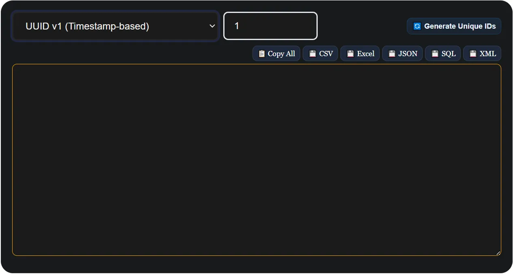

<section class="home-hero" aria-labelledby="intro-heading">
<h1 id="intro-heading" itemprop="headline">How To Generate UUID Online | Datafrog</h1>

<blockquote>
  <a href="/uuid-generator" class="link">
    Click here to create UUID, GUID, Nano ID, KSUID, ULID, CUID, and more.
  </a>
</blockquote>

  

    Every serious application — whether it's a SaaS product, a mobile app, or a distributed microservice — needs a reliable way to identify records uniquely. That's exactly what a UUID does. Short for Universally Unique Identifier, a UUID is a 128-bit value that your system can generate independently, on any machine, at any time, without ever checking with a central server. No collisions. No coordination. Just a unique ID, every single time.
  

  

    <a href="sohail-anwar" style="display:flex; gap: 10px;" class="link">
      
      
        Sohail Anwar
      
    </a>
    
      <time itemprop="datePublished" datetime="2026-06-02">June 02, 2026</time>
    
  

  <figure class="blog-image">
    
    <figcaption style="margin-top: -1.5rem; margin-bottom: 1rem; font-size: 8px">UUID Generator Online – Generate UUID v1, v4 and v7 Free</figcaption>
  </figure>

  

    In this guide, you will learn what a UUID actually is, see real UUID examples, understand the meaningful difference between UUID v1, v4, and v7, and learn how to generate one — instantly, for free — using DataFrog's online UUID generator. No code required. No account needed.
  

  <aside class="blog-tool-tip" aria-label="Free UUID Generator Tool">
    

      If you just need a UUID right now, head straight to our
      <a href="/uuid-generator" title="Free Online UUID Generator" class="link">free UUID generator</a>.
      Pick your version, set a quantity, and generate up to 1000 UUIDs in your browser — nothing is ever uploaded or stored.
    

  </aside>
</section>

<section aria-labelledby="what-is-uuid">
  <h2 id="what-is-uuid">What Is a UUID?</h2>
  

    A UUID is a standardised 36-character string defined by <a href="https://www.rfc-editor.org/rfc/rfc4122" class="link" target="_blank" rel="noopener noreferrer">RFC 4122</a>. It follows a fixed pattern of 32 hexadecimal characters split into five groups by hyphens:
  

  <pre style="background:#f4f4f4; padding: 1rem; border-radius: 6px; font-size: 1rem; overflow-x: auto;"><code>xxxxxxxx-xxxx-Mxxx-Nxxx-xxxxxxxxxxxx</code></pre>

  

    Where <code>M</code> is the version digit and <code>N</code> is the variant. A real UUID v4 example looks like this:
  

  <pre style="background:#f4f4f4; padding: 1rem; border-radius: 6px; font-size: 1rem; overflow-x: auto;"><code>f47ac10b-58cc-4372-a567-0e02b2c3d479</code></pre>

  

    That <code>4</code> in the third group tells you it's version 4. The structure isn't arbitrary — it carries meaning about how and when the identifier was created.
  

  

    UUIDs solve a real problem in software: how do you create a unique ID across many systems, databases, or services without asking a central authority to hand one out? The answer is mathematical probability. A UUID v4 has 122 random bits, which means the chances of two UUIDs ever being identical are roughly 1 in 5.3 × 10³⁶ — a number so large it has no practical meaning as a risk.
  

</section>

<section aria-labelledby="uuid-v1-v4-v7">
  <h2 id="uuid-v1-v4-v7">UUID v1, v4, and v7 — What's the Real Difference?</h2>
  

    The version number is not just a label. It tells you the exact algorithm used to generate the UUID, and that choice has real consequences for security, sortability, and database performance. Here is what each version actually does:
  

  <h3>UUID v1 — Timestamp and MAC Address</h3>
  

    UUID v1 combines a 60-bit timestamp (measured in 100-nanosecond intervals since October 1582) with your machine's MAC address. This makes it partially time-ordered and traceable — you can extract the creation time from a v1 UUID if needed.
  

  

    The downside is privacy. Because a v1 UUID embeds your network card's MAC address, generating one on a server can inadvertently expose hardware information. For most modern applications, this is a reason to avoid v1 unless you have a specific need for timestamp traceability.
  

  <pre style="background:#f4f4f4; padding: 1rem; border-radius: 6px; font-size: 1rem; overflow-x: auto;"><code>UUID v1 example:
6ba7b810-9dad-11d1-80b4-00c04fd430c8
          ↑ version 1</code></pre>

  <h3>UUID v4 — Fully Random</h3>
  

    UUID v4 is the most widely used version. It is generated entirely from cryptographically secure random numbers — 122 random bits — with no timestamp, no MAC address, and no system-specific data embedded anywhere. It tells you nothing about when or where it was created, which is exactly the point.
  

  

    This makes UUID v4 the safe default for the vast majority of use cases: API tokens, session identifiers, user IDs, order references, and anything where uniqueness matters but order does not.
  

  <pre style="background:#f4f4f4; padding: 1rem; border-radius: 6px; font-size: 1rem; overflow-x: auto;"><code>UUID v4 example:
550e8400-e29b-41d4-a716-446655440000
          ↑ version 4</code></pre>

  <h3>UUID v7 — Time-Ordered and Sortable</h3>
  

    UUID v7 is the modern answer to a real database problem. When you use random UUIDs (v4) as primary keys in a relational database, every new insert lands at a random position in the B-tree index. Over millions of rows, this causes excessive page splits and cache misses that hurt write performance.
  

  

    UUID v7 fixes this by embedding a Unix millisecond timestamp in the first 48 bits. New records inserted in chronological order are also in lexicographic order, which keeps index pages contiguous and writes fast. It is now the recommended format for database primary keys in PostgreSQL, MySQL, and any system where you expect high insert volume over time.
  

  <pre style="background:#f4f4f4; padding: 1rem; border-radius: 6px; font-size: 1rem; overflow-x: auto;"><code>UUID v7 example:
018fea3d-4b6c-7e2a-9f1b-3c5d8e0a1b2c
          ↑ version 7</code></pre>

  <table style="width:100%; border-collapse: collapse; font-family: Georgia, serif; font-size: 1rem; margin: 1.5rem 0;">
    <thead>
      <tr style="background:#f0f0f0;">
        <th style="padding: 10px; border: 1px solid #ddd; text-align: left;">Version</th>
        <th style="padding: 10px; border: 1px solid #ddd; text-align: left;">Based On</th>
        <th style="padding: 10px; border: 1px solid #ddd; text-align: left;">Sortable?</th>
        <th style="padding: 10px; border: 1px solid #ddd; text-align: left;">Privacy Safe?</th>
        <th style="padding: 10px; border: 1px solid #ddd; text-align: left;">Best For</th>
      </tr>
    </thead>
    <tbody>
      <tr>
        <td style="padding: 10px; border: 1px solid #ddd;">v1</td>
        <td style="padding: 10px; border: 1px solid #ddd;">Timestamp + MAC</td>
        <td style="padding: 10px; border: 1px solid #ddd;">Partially</td>
        <td style="padding: 10px; border: 1px solid #ddd;">No</td>
        <td style="padding: 10px; border: 1px solid #ddd;">Timestamp traceability</td>
      </tr>
      <tr>
        <td style="padding: 10px; border: 1px solid #ddd;">v4</td>
        <td style="padding: 10px; border: 1px solid #ddd;">Fully random</td>
        <td style="padding: 10px; border: 1px solid #ddd;">No</td>
        <td style="padding: 10px; border: 1px solid #ddd;">Yes</td>
        <td style="padding: 10px; border: 1px solid #ddd;">General purpose — safest default</td>
      </tr>
      <tr>
        <td style="padding: 10px; border: 1px solid #ddd;">v7</td>
        <td style="padding: 10px; border: 1px solid #ddd;">Timestamp (ms) + random</td>
        <td style="padding: 10px; border: 1px solid #ddd;">Yes</td>
        <td style="padding: 10px; border: 1px solid #ddd;">Yes</td>
        <td style="padding: 10px; border: 1px solid #ddd;">Database primary keys at scale</td>
      </tr>
    </tbody>
  </table>
</section>

<section aria-labelledby="how-to-generate">
  <h2 id="how-to-generate">How to Generate a UUID Online</h2>
  

    DataFrog's <a href="/uuid-generator" class="link" title="Online UUID Generator">online UUID generator</a> runs entirely in your browser. Nothing is sent to any server. Here's how to use it:
  

  <ol>
    <li>
      <strong>Choose your UUID version</strong> — select UUID v1, v4, or v7 from the format dropdown depending on your use case. When in doubt, select v4.
    </li>
    <li>
      <strong>Set the quantity</strong> — enter any number from 1 to 1000. Useful for bulk database seeding, load testing, or generating a list of test tokens.
    </li>
    <li>
      <strong>Click Generate</strong> — your UUIDs appear instantly in the output panel.
    </li>
    <li>
      <strong>Copy or export</strong> — copy all IDs to clipboard with one click, or download as CSV, JSON, Excel, SQL INSERT statements, or XML.
    </li>
  </ol>

  <aside class="blog-tool-tip" aria-label="Try the UUID Generator">
    

      <a href="/uuid-generator" class="link" title="UUID Generator Online">Try the UUID generator now</a> — no signup, no file uploads, works offline after the first page load.
    

  </aside>
</section>

<section aria-labelledby="uuid-in-code">
  <h2 id="uuid-in-code">How to Generate a UUID in Code</h2>
  

    When you need UUID generation built into your application rather than a one-off online tool, here are the native approaches for the most common languages:
  

  <h3>JavaScript / Node.js</h3>
  <pre style="background:#f4f4f4; padding: 1rem; border-radius: 6px; font-size: 1rem; overflow-x: auto;"><code>// Native — works in modern browsers and Node.js 19+
const id = crypto.randomUUID(); // UUID v4

// Using the uuid npm package (supports v1, v4, v7)
import { v4 as uuidv4, v7 as uuidv7 } from 'uuid';
const idV4 = uuidv4();
const idV7 = uuidv7();</code></pre>

  <h3>Python</h3>
  <pre style="background:#f4f4f4; padding: 1rem; border-radius: 6px; font-size: 1rem; overflow-x: auto;"><code>import uuid

id_v4 = str(uuid.uuid4())  # UUID v4
id_v1 = str(uuid.uuid1())  # UUID v1</code></pre>

  <h3>PostgreSQL</h3>
  <pre style="background:#f4f4f4; padding: 1rem; border-radius: 6px; font-size: 1rem; overflow-x: auto;"><code>-- UUID v4 (built-in)
SELECT gen_random_uuid();

-- Use UUID as a primary key column type
CREATE TABLE users (
  id UUID PRIMARY KEY DEFAULT gen_random_uuid(),
  name TEXT
);</code></pre>

  <h3>C# / .NET</h3>
  <pre style="background:#f4f4f4; padding: 1rem; border-radius: 6px; font-size: 1rem; overflow-x: auto;"><code>// UUID v4 (called GUID in .NET)
Guid id = Guid.NewGuid();
string idString = id.ToString(); // "550e8400-e29b-41d4-a716-446655440000"</code></pre>

  

    For anything beyond quick testing, use your language's native crypto library rather than a custom implementation. The online generator is best for one-off generation, testing, and working with formats your language doesn't natively support (like UUID v7 in older environments).
  

</section>

<section aria-labelledby="when-to-use">
  <h2 id="when-to-use">When Should You Use a UUID?</h2>
  

    UUIDs are not always the right tool — but they are the right tool more often than most developers realise. Here is a practical breakdown:
  

  <ul>
    <li><strong>Database primary keys</strong> — use UUID v7 if you care about insert performance at scale; v4 otherwise.</li>
    <li><strong>API request IDs</strong> — attach a UUID v4 to every request for distributed tracing and debugging.</li>
    <li><strong>Session tokens</strong> — UUID v4 provides sufficient randomness for secure session identifiers.</li>
    <li><strong>File naming in cloud storage</strong> — prefix filenames with a UUID to prevent overwrites in S3, GCS, or Azure Blob.</li>
    <li><strong>Idempotency keys</strong> — send a UUID with API requests to safely retry without duplicate processing.</li>
    <li><strong>Test data generation</strong> — bulk-generate UUIDs to seed a development or staging database.</li>
  </ul>
  

    Where UUIDs are <em>not</em> ideal: when you need human-readable IDs (use sequential integers or short codes), or when you need URL-safe compact identifiers (consider NanoID or ULID — covered in separate guides).
  

</section>

<section aria-labelledby="uuid-storage">
  <h2 id="uuid-storage">Storing UUIDs in a Database — the Right Way</h2>
  

    How you store a UUID matters as much as how you generate it. Two common mistakes cost performance unnecessarily:
  

  <ul>
    <li>
      <strong>Storing as VARCHAR(36)</strong> — this stores the 36-character hyphenated string as text. It works, but it uses more space and is slower to index than a native UUID type.
    </li>
    <li>
      <strong>Storing as CHAR(32)</strong> — slightly better (no hyphens), but still text-based and slower than binary.
    </li>
  </ul>
  

    The correct approach depends on your database:
  

  <ul>
    <li><strong>PostgreSQL</strong> — use the native <code>UUID</code> column type. It stores 16 bytes and indexes efficiently.</li>
    <li><strong>MySQL 8+</strong> — use <code>BINARY(16)</code> and store UUIDs with <code>UUID_TO_BIN(uuid, true)</code> (the <code>true</code> flag reorders bytes for better index locality with v1 UUIDs).</li>
    <li><strong>MongoDB</strong> — use the native <code>BinData</code> subtype 3 or 4 for UUID storage rather than storing as a string.</li>
    <li><strong>SQLite</strong> — no native UUID type; <code>TEXT</code> or <code>BLOB</code> are your options. BLOB is more efficient.</li>
  </ul>
</section>

<section aria-labelledby="conclusion-heading">
  <h2 id="conclusion-heading">Conclusion</h2>
  

    UUIDs are one of those foundational tools in software development that you reach for so often they become second nature. The key decisions are simple: use <strong>UUID v4</strong> as your default for anything where randomness is the priority, switch to <strong>UUID v7</strong> when your database needs time-ordered inserts, and use <strong>UUID v1</strong> only if you have a specific need to trace creation timestamps.
  

  

    For one-click generation — single or bulk — 
    <a href="/uuid-generator" title="UUID Generator Online" class="link">DataFrog's free UUID generator</a> 
    handles all three versions with export to CSV, JSON, SQL, Excel, and XML. Everything runs in your browser, nothing leaves your device.
  

</section>

<section aria-labelledby="faq-heading">
  <h2 id="faq-heading">Frequently Asked Questions</h2>

  

    
What does UUID stand for?

    

      UUID stands for Universally Unique Identifier. It is a 128-bit identifier standardised by RFC 4122, formatted as a 36-character hyphenated hexadecimal string. It is designed to be unique across all machines, networks, and time without requiring central coordination.
    

  

  

    
What is the difference between UUID v1, v4, and v7?

    

      UUID v1 is generated from a timestamp and your machine's MAC address — partially sortable but not privacy-safe. UUID v4 is fully random with no system data embedded — the safest general-purpose choice. UUID v7 embeds a millisecond Unix timestamp making it time-sortable, which is ideal for database primary keys where index performance matters.
    

  

  

    
How do I generate a random UUID online?

    

      Open <a href="/uuid-generator" class="link" title="UUID Generator">DataFrog's UUID generator</a>, select your preferred version (v1, v4, or v7), set the quantity, and click Generate. Your UUIDs are ready to copy or download — no signup required.
    

  

  

    
Is UUID v4 the same as UUID4?

    

      Yes. UUID4 and UUID v4 refer to the same thing — version 4 of the UUID standard. Some libraries and documentation use the shorthand UUID4 (no space), but they are identical in meaning and output.
    

  

  

    
Can two UUIDs ever be the same?

    

      In theory yes, but in practice the probability is negligible. A UUID v4 has 122 random bits, giving approximately 5.3 × 10³⁶ possible values. Even generating a billion UUIDs per second for a trillion years, the chance of a collision would remain astronomically small.
    

  

  

    
Why should I use UUID v7 instead of v4 for database keys?

    

      When UUID v4 (random) is used as a primary key, each new insert lands at a random position in the database's B-tree index. This causes frequent page splits and cache misses as the table grows. UUID v7 embeds a timestamp so new records are always inserted at the end of the index, keeping writes fast and the index compact — the same benefit as auto-increment integers but with global uniqueness.
    

  

  

    
What does a UUID v4 look like?

    

      A UUID v4 is a 36-character string in this format: <code>550e8400-e29b-41d4-a716-446655440000</code>. The <code>4</code> in the third group identifies the version. All 32 hex characters except the version and variant bits are randomly generated.
    

  

  

    
Is it safe to use UUIDs generated online?

    

      Yes, when using a browser-based tool like DataFrog's generator. All generation happens locally using the browser's built-in <code>crypto.getRandomValues()</code> API — the same cryptographic randomness source used in production security software. Your UUIDs are never transmitted to or stored on any server.
    

  

</section>

<!-- closes itemscope Article -->

<script type="application/ld+json">
{
  "@context": "https://schema.org",
  "@type": "FAQPage",
  "mainEntity": [
    {
      "@type": "Question",
      "name": "What does UUID stand for?",
      "acceptedAnswer": {
        "@type": "Answer",
        "text": "UUID stands for Universally Unique Identifier. It is a 128-bit identifier standardised by RFC 4122, formatted as a 36-character hyphenated hexadecimal string, designed to be unique across all machines and time without central coordination."
      }
    },
    {
      "@type": "Question",
      "name": "What is the difference between UUID v1, v4, and v7?",
      "acceptedAnswer": {
        "@type": "Answer",
        "text": "UUID v1 uses a timestamp and MAC address — partially sortable but not privacy-safe. UUID v4 is fully random with no system data — the best general-purpose choice. UUID v7 embeds a millisecond Unix timestamp for time-sortable output, ideal for database primary keys where index performance matters."
      }
    },
    {
      "@type": "Question",
      "name": "Is UUID v4 the same as UUID4?",
      "acceptedAnswer": {
        "@type": "Answer",
        "text": "Yes. UUID4 and UUID v4 refer to the same thing — version 4 of the UUID standard, generated using cryptographically secure random numbers."
      }
    },
    {
      "@type": "Question",
      "name": "Why should I use UUID v7 instead of v4 for database keys?",
      "acceptedAnswer": {
        "@type": "Answer",
        "text": "UUID v4 is fully random, so each insert lands at a random position in the database B-tree index, causing page splits at scale. UUID v7 is time-ordered, so new records always insert at the end of the index — keeping writes fast and efficient, like auto-increment integers but globally unique."
      }
    },
    {
      "@type": "Question",
      "name": "Is it safe to use UUIDs generated online?",
      "acceptedAnswer": {
        "@type": "Answer",
        "text": "Yes, when using a browser-based tool like DataFrog's UUID generator. Generation happens locally using the browser's crypto.getRandomValues() API. Your UUIDs are never transmitted to or stored on any server."
      }
    }
  ]
}
